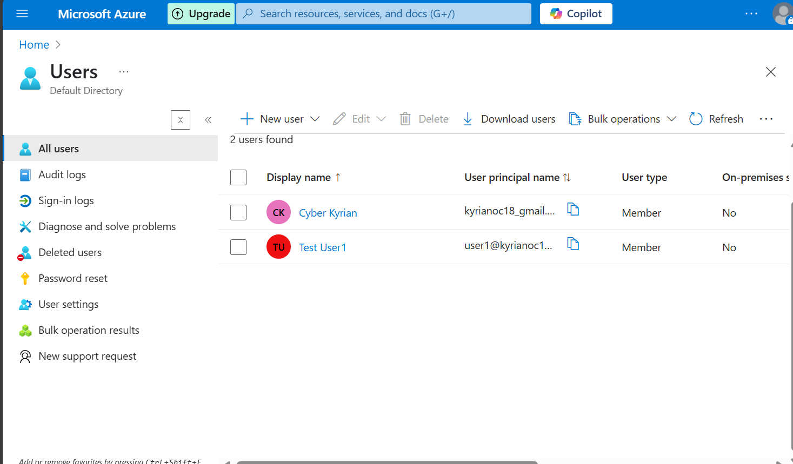
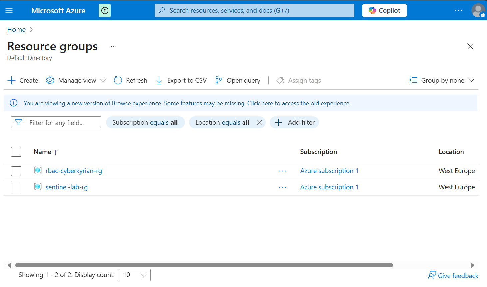
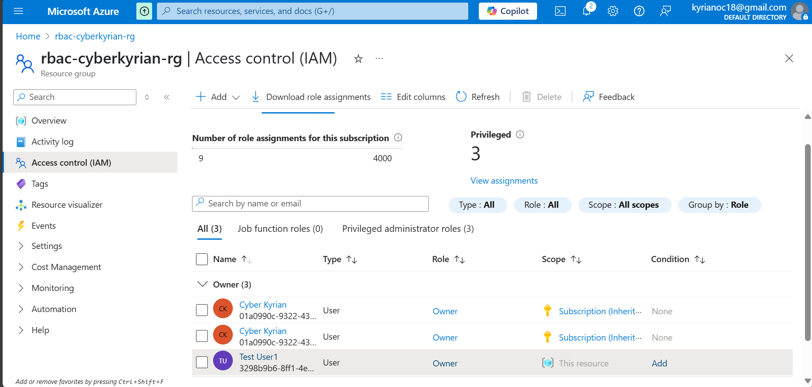
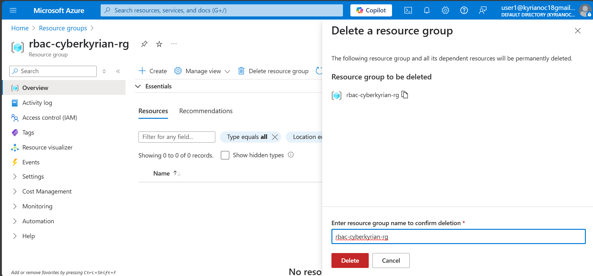
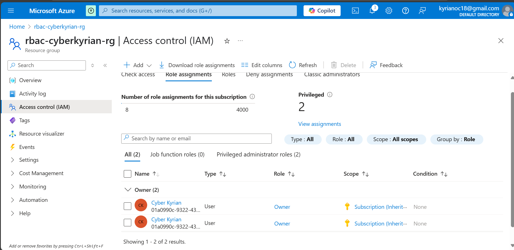
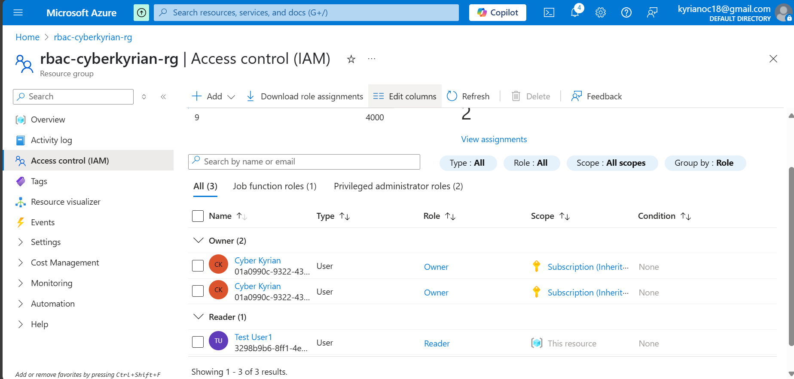
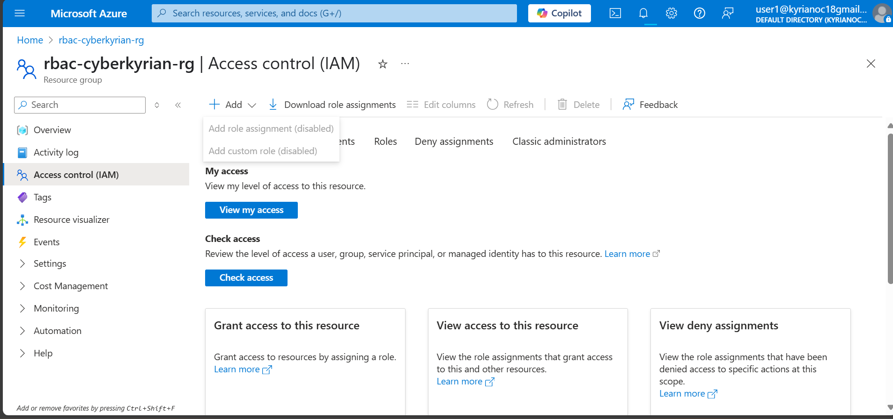

# Azure RBAC Misconfiguration & Hardening Lab

### Author: Kyrian Onyeagusi
🔗 [LinkedIn](https://www.linkedin.com/in/kyrian-onyeagusi/) | 📧 [Email](mailto:kyrianoc18@gmail.com)

### Focus: Simulating and remediating IAM misconfigurations using Azure Role-Based Access Control (RBAC)

---

## Overview

In this project, I explored a real-world Azure RBAC (Role-Based Access Control) misconfiguration and implemented secure access controls to enforce the Principle of Least Privilege (PoLP).

The lab simulates what happens when a user is mistakenly granted excessive privileges in a cloud environment — a common cause of data breaches — and how this can be identified and fixed using built-in Azure tools.

---

## Tools & Skills Demonstrated

* Microsoft Azure Portal
* Azure RBAC (Role-Based Access Control)
* Azure Resource Groups & Subscriptions
* IAM Auditing & Policy Review
* Access Misconfiguration Simulation
* Principle of Least Privilege (PoLP)

---

## Environment Setup

* Microsoft Azure
* One Azure Subscription with permission to manage IAM
* Two test users

> ✅ **Screenshot:** Azure Portal dashboard with user accounts created
> 

---

## What I Did

I created a new Azure Resource Group and assigned the **Owner** role to a test user (`user1@...`). This excessive permission allowed the user to modify IAM settings and delete resources — a clear violation of PoLP.

> ✅ **Screenshot:** Azure portal showing `rbac-test-rg` resource group created
> 

> ✅ **Screenshot:** `user1` mistakenly assigned the Owner role
> 

Using a private session, I logged in as `user1` and demonstrated the ability to access privileged actions such as IAM role assignments and deletion.

> ✅ **Screenshot:** `user1` accessing elevated IAM controls
> 

To fix the issue, I removed the Owner role and reassigned a Reader role — enforcing least privilege.

> ✅ **Screenshot:** Owner role removed from `user1`
> 

> ✅ **Screenshot:** Reader role applied to `user1` via IAM
> 

I then re-logged in as `user1` to confirm they could no longer access or modify protected resources.

> ✅ **Screenshot:** Access denied when `user1` tries privileged action
> 
---

## Why This Matters

IAM misconfiguration is one of the most frequent cloud vulnerabilities. This project shows I understand how to:

* Identify dangerous privilege assignments
* Audit and remediate IAM issues
* Apply secure role delegation in Microsoft Azure

---

## Outcome

This project proves my ability to:

* Conduct IAM reviews
* Implement security policy corrections
* Reduce identity-based risk in Azure environments

---

## 🔗 Connect

**Kyrian Onyeagusi**
🔗 [LinkedIn](https://www.linkedin.com/in/kyrian-onyeagusi/) | 📧 [Email](mailto:kyrianoc18@gmail.com)
